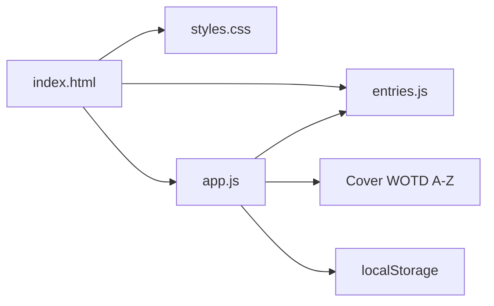

<p align="center">
  
</p>

<p align="center"><em>One desk. Three windows. A small dictionary written by hand.</em></p>

# What I Mean When I Say

**A small personal dictionary — about one hundred words, defined the way a particular Thai anthropologist actually means them.**

[](LICENSE)
[](#how-to-use--learn)
[](#how-to-use--learn)

[Read it](https://mean.nonarkara.org) · [Fork the method](https://github.com/Nonarkara/mean/fork) · [Author](https://github.com/Nonarkara)

By [Non Arkaraprasertkul](https://github.com/Nonarkara) (Nonarkara) — Axiom X Co., Ltd., Bangkok.

This is an independent studio book. It is **not** a MEAN-stack starter, not a ranking, and not an official government glossary.

---

## What this is

A static website that is also a book: *What I Mean When I Say*, Edition One (2026). The cover and menu describe it as a small dictionary of words the author has used wrong, and a smaller list of words used right — some jokes, some arguments, most confessions.

The lexicon lives in `entries.js` as `window.LEXICON` (104 headwords in this tree). The page copy says about one hundred entries in three of the author’s languages, plus a few imports from elsewhere. Each entry can carry:

- a headword, optional IPA, part of speech, and origin line
- one or more numbered definitions
- optional examples
- optional cross-references (`see`) to other entries

The page around the lexicon, all in this repository:

| Surface | What it does |
| --- | --- |
| Cover | Title, reading note, keyboard hints (`A` `/` `R` `↓`) |
| Word of the day | One entry, same for everyone until midnight UTC |
| Dictionary | Entries grouped A–Z, two columns on wide screens |
| Search / random | Overlay search (`/`) and a random jump (`R`) |
| Menu | A short note on the book, local read counts |
| Colophon | Typefaces, print invitation, cities |
| Library | Links to other books by the same author |

Reading state (bookmark, visited entries, day streak) stays in the browser via `localStorage`. There is no backend, no package manager, and no build step.

**This repo is not:**

- The MEAN stack (Mongo, Express, Angular, Node). The name is the verb *mean*.
- A city index, score, or black-box ranking.
- A dump of deploy tokens, analytics keys, or account IDs.

---

## Philosophy

Fork the **method**, not the secrets. The method here is small: one person’s lexicon, written as definitions, shipped as four static files a learner can read in an afternoon. Take the form — headword, honesty, cross-links — and write your own book. Leave credentials, account caches, and beacon tokens where they belong: out of git.

**One Mac.** This site is HTML, CSS, and JavaScript. One laptop can serve it. No framework, no CI ritual, no vendor dashboard required to understand what you are looking at.

**No black-box rankings.** Nothing here is scored. There is no hidden weight, no “top word,” no index pretending to be science. The X entry is empty on purpose: *the words I do not have are still being looked for.*

**Thai–English as the audience.** The studio writes for readers who live between languages. The UI is English; Thai type (Sarabun, Noto Serif Thai) is loaded for the seal and for Thai headwords such as *เกรงใจ*, *ไม่เป็นไร*, *สบาย*. Japanese, Chinese, Latin, and Greek appear as imports, not as decoration.

Company: **Axiom X Co., Ltd.** Author: **Non Arkaraprasertkul** (Nonarkara). The colophon is first-person and local: Bangkok · Shanghai · Boston.

---

## Ethical use

This is one writer’s lexicon, offered free to read, print, and gift. The colophon is explicit: the text is his; the words themselves are anyone’s. Argue with it. Cross out a definition and write your own.

**Do**

- Treat every definition as a personal claim, not as a standard, a policy, or an official translation.
- Keep reading state on the reader’s machine. The site already does this with `localStorage` keys under `mean:`.
- Attribute the author if you quote or fork the prose.
- If you add hosting or analytics, keep tokens in the operator’s environment — never in a pull request.

**Do not**

- Present this book as a government, university, or municipal glossary.
- Rank, score, or “benchmark” the entries. That is the opposite of the work.
- Commit API keys, analytics tokens, Wrangler account files, or `.env` contents.
- Invent a live URL, a metric, or an award that is not in this tree.
- Use the library links, or the author’s other books, as a claim that those projects endorse a use they do not.

If a contribution only works by pasting a secret, it does not belong here.

---

## How to use / learn

There is nothing to install.

```bash
python3 -m http.server 8080
```

Open [http://localhost:8080](http://localhost:8080). Or open `index.html` directly. The page loads webfonts from Google Fonts (Ibarra Real Nova, Cormorant Garamond, EB Garamond, IBM Plex Mono, Sarabun, Noto Serif Thai).

A published copy of this same tree is linked from the page itself: [mean.nonarkara.org](https://mean.nonarkara.org).

**Read it two ways** (from the menu in `index.html`): A to Z, in roughly half an hour — or one entry a day. The word of the day is `utcDay % lexiconLength`, so every visitor sees the same entry until midnight UTC.

**Keyboard** (ignored while a field is focused):

| Key | Action |
| --- | --- |
| `/` | Search |
| `R` | Random entry |
| `Esc` | Close search or menu |
| letters | Jump from the alphabet bar |

Arrow keys and Enter walk search results.

**Learn by forking the method.** To add a headword, append an object to `window.LEXICON` in `entries.js`:

```js
{
  word: "Example",
  ipa: "optional",
  origin: "optional etymology line",
  pos: "n.",
  defs: ["What you actually mean."],
  examples: ["Optional sentence in use."],
  see: ["related-slug"]
}
```

`app.js` slugs the headword for `id` and `#` links. Cross-references in `see` must match those slugs. Bump the `?v=` query on `entries.js` / `app.js` / `styles.css` in `index.html` if you need caches to drop.

| File | Role |
| --- | --- |
| `index.html` | Cover, word of the day, dictionary mount, colophon, library |
| `entries.js` | Lexicon data |
| `app.js` | Render, search, WOTD, keyboard, localStorage |
| `styles.css` | Paper, forest, gold — print rules included |
| `_headers` | Cache-Control for Cloudflare Pages-style hosts |
| `docs/hero-banner.png` | README illustration only; not used by the site |

---

## System diagram



Cover, word of the day, and the A–Z body all read the same array. Search and random are jumps into that array. The browser remembers where you left off; the server does not.

---

## License / contributing

This repository is licensed under the [MIT License](LICENSE).

Copyright © 2026 Non Arkaraprasertkul / Axiom X Co., Ltd.

The MIT grant covers **this repository** — the static site and the lexicon as published here. It does not relicense other books in the library footer, upstream typefaces, or any hosting account.

Reuse the method with attribution. If you print the book, the colophon already invited you to.

**Contributing.** Open a pull request against `main`.

- Fixes to prose, type, accessibility, and missing cross-references are welcome.
- New entries should sound like the rest of the book: short, first-person, no fake scholarship.
- Do not add rankings, leaderboards, or “scores.”
- Do not commit `.env`, `.wrangler/`, or tokens.
- Do not rewrite the philosophy to taste.

If you build your own small dictionary from this form, that is the point.
